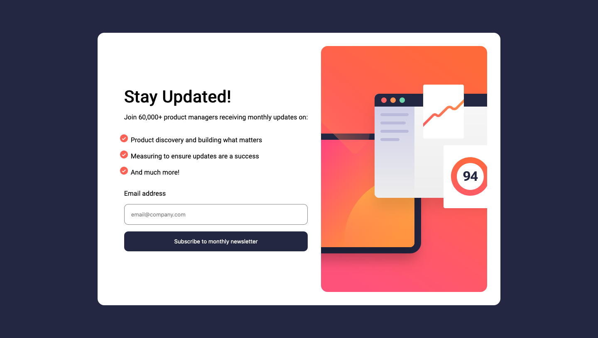

# Frontend Mentor - Newsletter sign-up form with success message solution

This is a solution to the [Newsletter sign-up form with success message challenge on Frontend Mentor](https://www.frontendmentor.io/challenges/newsletter-signup-form-with-success-message-3FC1AZbNrv). Frontend Mentor challenges help you improve your coding skills by building realistic projects.

## Table of contents

- [Overview](#overview)
  - [The challenge](#the-challenge)
  - [Screenshot](#screenshot)
  - [Links](#links)
- [My process](#my-process)
  - [Built with](#built-with)
  - [What I learned](#what-i-learned)
  - [Continued development](#continued-development)
- [Author](#author)

## Overview

### The challenge

Users should be able to:

- Add their email and submit the form
- See a success message with their email after successfully submitting the form
- See form validation messages if:
  - The field is left empty
  - The email address is not formatted correctly
- View the optimal layout for the interface depending on their device's screen size
- See hover and focus states for all interactive elements on the page

### Screenshot



### Links

- Solution URL: [](https://github.com/csoumya14/NewsLetterSignUP.git)
- Live Site URL: [](https://news-letter-sign-qfk961hxe-csoumya14.vercel.app/)

## My process

### Built with

- Semantic HTML5 markup
- CSS custom properties
- Flexbox
- Mobile-first workflow
- [React](https://reactjs.org/) - JS library
- [Typescript](https://www.typescriptlang.org/) - Javascript with syntax for types
- [Next.js](https://nextjs.org/) - React framework
- [Styled Components](https://styled-components.com/) - For styles
- [React Hook Form](https://www.react-hook-form.com/) - For form inputs
- [Yup](https://www.npmjs.com/package/yup) - For form validation

### What I learned

Use this section to recap over some of your major learnings while working through this project. Writing these out and providing code samples of areas you want to highlight is a great way to reinforce your own knowledge.

- I learned how to incorporate yup for form validation.
- How to make a reusable button component
- How to style a reusable component with styled components.

```html
<h1>Some HTML code I'm proud of</h1>
```

```css
`${({ error }) =>
    error &&
    `
     border: 1px solid #FF6155;
      background: rgba(255,97,85,.2);
      color: #ff6155;
    `}``
```

```js
useEffect(() => {
  const handleWindowResize = () => setWidth(window.innerWidth);
  window.addEventListener('resize', handleWindowResize);
  handleWindowResize();
  return () => window.removeEventListener('resize', handleWindowResize);
}, []);
```

### Continued development

I am not fully convinced with the way layout adjust to different screen sizes. Especially with smaller screen sizes. In future project I want to investigate a better way of doing it.

## Author

- Frontend Mentor - [@csoumya14](https://www.frontendmentor.io/profile/csoumya14)
- Twitter - [@Soumya_coder](https://twitter.com/Soumya_coder)
